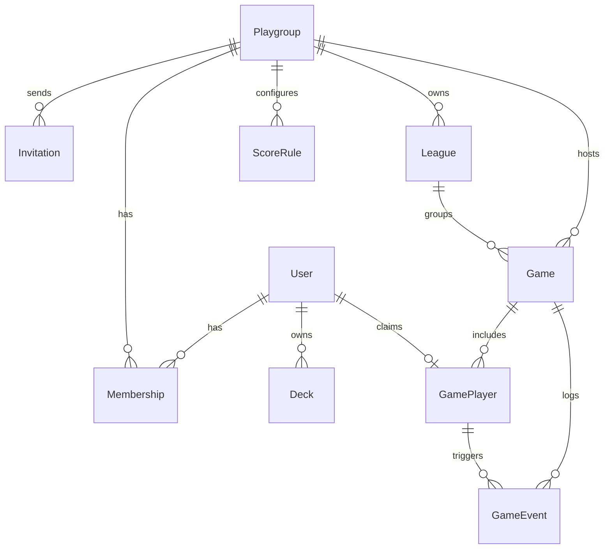

# Bloque 2 — Modelo de datos (propuesta)

Stack objetivo: **Next.js + TypeScript + Prisma + PostgreSQL + NextAuth.js**

## Diagrama entidad-relación (resumen)



## Esquema Prisma (borrador)

```prisma
// prisma/schema.prisma — borrador para Fase 4+

model User {
  id            String       @id @default(cuid())
  email         String       @unique
  name          String?
  image         String?
  emailVerified DateTime?
  accounts      Account[]
  sessions      Session[]
  memberships   Membership[]
  decks         Deck[]
  gamePlayers   GamePlayer[]
  createdAt     DateTime     @default(now())
  updatedAt     DateTime     @updatedAt
}

model Playgroup {
  id          String       @id @default(cuid())
  name        String
  slug        String       @unique
  memberships Membership[]
  invitations Invitation[]
  games       Game[]
  leagues     League[]
  scoreRules  ScoreRule[]
  createdAt   DateTime     @default(now())
}

model Membership {
  id          String    @id @default(cuid())
  userId      String
  playgroupId String
  role        Role      @default(MEMBER)
  user        User      @relation(fields: [userId], references: [id])
  playgroup   Playgroup @relation(fields: [playgroupId], references: [id])
  @@unique([userId, playgroupId])
}

enum Role {
  ADMIN
  MEMBER
}

model Invitation {
  id          String    @id @default(cuid())
  playgroupId String
  email       String?
  token       String    @unique
  expiresAt   DateTime
  playgroup   Playgroup @relation(fields: [playgroupId], references: [id])
}

model Deck {
  id            String   @id @default(cuid())
  userId        String
  name          String
  commanderName String?
  colorIdentity String[] // W,U,B,R,G
  archidektUrl  String?
  user          User     @relation(fields: [userId], references: [id])
  gamePlayers   GamePlayer[]
}

model Game {
  id           String       @id @default(cuid())
  playgroupId  String?
  leagueId     String?
  status       GameStatus   @default(IN_PROGRESS)
  startedAt    DateTime
  endedAt      DateTime?
  winCondition WinCondition?
  syncChannel  String?      @unique // Device Sync / Realtime room
  playgroup    Playgroup?   @relation(fields: [playgroupId], references: [id])
  league       League?      @relation(fields: [leagueId], references: [id])
  players      GamePlayer[]
  events       GameEvent[]
}

enum GameStatus {
  IN_PROGRESS
  COMPLETED
  ABANDONED
}

enum WinCondition {
  COMBAT
  COMMANDER
  POISON
  MILL
  OTHER
}

model GamePlayer {
  id           String   @id @default(cuid())
  gameId       String
  seatIndex    Int
  displayName  String
  isGuest      Boolean  @default(false)
  userId       String?  // null = guest local; reclamable después
  deckId       String?
  mulligans    Int      @default(0)
  placement    Int?     // 1 = winner
  eliminatedBy String?  // GamePlayer.id
  game         Game     @relation(fields: [gameId], references: [id])
  user         User?    @relation(fields: [userId], references: [id])
  deck         Deck?    @relation(fields: [deckId], references: [id])
  events       GameEvent[]
}

model GameEvent {
  id           String        @id @default(cuid())
  gameId       String
  at           DateTime
  kind         GameEventKind
  playerId     String?
  targetId     String?
  sourceId     String?
  amount       Int?
  message      String
  meta         Json?
  syncVersion  Int           @default(0) // offline-first ordering
  game         Game          @relation(fields: [gameId], references: [id])
  player       GamePlayer?   @relation(fields: [playerId], references: [id])
}

enum GameEventKind {
  GAME_START
  TURN_PASS
  LIFE_CHANGE
  COMMANDER_DAMAGE
  POISON_CHANGE
  COUNTER_CHANGE
  COMBAT_RESOLVED
  ELIMINATION
  REVIVE
  FIRST_BLOOD
  KNOCKOUT
  MONARCH
  NOTE
  MULLIGAN
  DICE_ROLL
  WIN_CONDITION
}

model League {
  id          String    @id @default(cuid())
  playgroupId String
  name        String
  rules       Json?     // filtros: cEDH, precons, noche temática...
  playgroup   Playgroup @relation(fields: [playgroupId], references: [id])
  games       Game[]
}

model ScoreRule {
  id          String    @id @default(cuid())
  playgroupId String
  key         String    // kill, first_blood, long_turn_penalty...
  points      Int
  playgroup   Playgroup @relation(fields: [playgroupId], references: [id])
  @@unique([playgroupId, key])
}
```

## Sync offline-first (app)

Cola local en la app:

```typescript
type PendingSyncEvent = {
  localId: string;
  gameId: string;
  payload: GameEvent;
  createdAt: number;
  retries: number;
};
```

Flujo: mutación local → append a `events` + enqueue → WebSocket/REST al reconectar → `syncVersion` monotónico en servidor.

## Dependencias nuevas previstas

| Fase | Paquete | Uso |
|------|---------|-----|
| 4 | `next`, `prisma`, `@prisma/client`, `next-auth` | Backend + auth |
| 5 | `@supabase/supabase-js` o `pusher-js` | Realtime Device Sync |
| 5 | `uuid` / `nanoid` | IDs de eventos sync |
| 7 | fetch Archidekt API | Import mazos |
| 3 | `expo-av` | Sonidos de vida/combate |

La app móvil actual **no requiere** backend hasta Fase 4; Fase 1–3 son 100 % locales con eventos en `GameState.events`.
